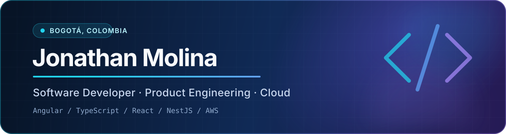

  

  
  
  

## About me

I'm a product-minded software developer based in Bogotá, Colombia. I turn business needs into maintainable web experiences, with a strong foundation in Angular and TypeScript and a growing focus on full-stack systems, cloud delivery and developer experience.

- Building HR products and internal tools that simplify complex workflows.
- Shipping frontend systems with **Angular, React, Vue and TypeScript**.
- Designing APIs with **Node.js, NestJS, MongoDB and Spring Boot**.
- Deploying repeatable infrastructure with **AWS, Docker and GitHub Actions**.
- Exploring secure systems and human-controlled AI through **Brane OS**.

## Current focus

| Product engineering | Cloud & backend | Systems exploration |
| --- | --- | --- |
| Accessible interfaces, reusable design systems and reliable state management | Secure APIs, observable services and automated deployments | Rust, capability-based security and policy-controlled AI |

## Enterprise experience

Since 2023, my Git history reflects sustained work across a private HR product ecosystem. I keep the implementation details confidential, but the engineering scope includes:

- Evolving large Angular and TypeScript applications through shared components, design tokens and cross-product visual migrations.
- Building role- and scope-aware workflows for projects, approvals, time records, dashboards and operational reporting.
- Connecting frontend experiences with Node.js services, authentication, notifications and enterprise integrations.
- Coordinating reviewed releases across development, QA, staging and production environments.

## Selected work

| Project | What it explores | Stack |
| --- | --- | --- |
| [**Brane OS**](https://github.com/Jonme-Mopri/braneOS) | A modular operating system with capability-based security, auditability and a policy-controlled AI subsystem. | Rust, Python, QEMU |
| [**jonmemopri.com**](https://jonmemopri.com) | My production portfolio: a React frontend on CloudFront and a NestJS API running on EC2 with MongoDB Atlas. | React, TypeScript, NestJS, MongoDB, AWS |
| [**Spring Microservices**](https://github.com/Jonme-Mopri/Proyect-Microservices-Spring) | A distributed learning platform with centralized configuration, discovery, gateway, course and student services. | Java, Spring Boot, Eureka |
| [**Stock Companies**](https://github.com/Jonme-Mopri/Stock-Companies) | A mobile stock-tracking experience with search, watchlists, charts and gesture-driven interactions. | React Native, Expo, TypeScript |
| [**Flight Price Tracker**](https://github.com/Jonme-Mopri/Flight-tracking-in-python) | Browser automation that monitors Google Flights and sends email alerts when prices cross a threshold. | Python, Selenium |

## Toolbox

  

## How I work

- Start with the user and the problem, then choose the technology.
- Prefer small, testable pieces over accidental complexity.
- Treat accessibility, security and observability as product requirements.
- Automate builds and deployments so releases stay boring and repeatable.

## Let's build something useful

I'm open to collaborating on frontend platforms, HR technology, developer tooling and thoughtful open-source projects.

  <a href="mailto:jonathanjdml@hotmail.com"><strong>Start a conversation</strong></a>
  ·
  <a href="https://jonmemopri.com"><strong>Visit my portfolio</strong></a>
  ·
  <a href="https://github.com/Jonme-Mopri?tab=repositories"><strong>Browse all projects</strong></a>

